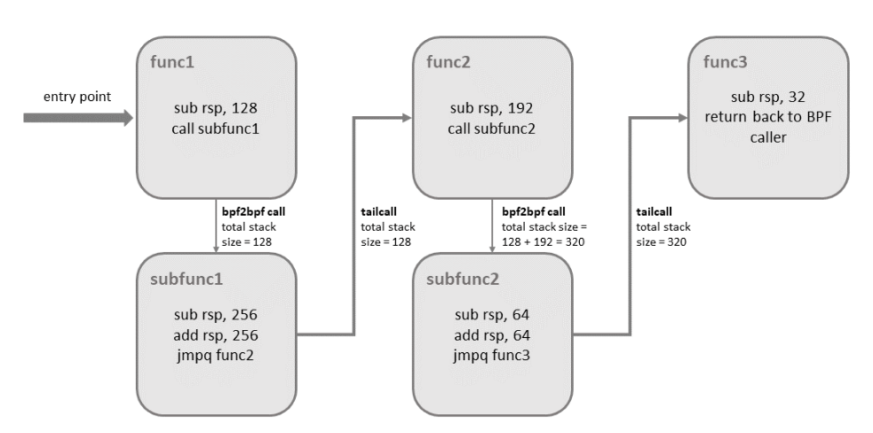

BPF to BPF Calls
=================


# BPF 调用与尾调用

除了 BPF 帮助程序调用和 BPF 尾调用之外，添加到 BPF 核心基础结构的最新功能是 BPF 到 BPF 调用。在将此功能引入内核之前，典型的 BPF C 程序必须声明任何可重用的代码，例如，这些代码驻留在always_inline标头中，以便当 LLVM 编译并生成 BPF 对象文件时，所有这些函数都是内联的，因此在生成的对象文件中多次重复，人为地夸大了其代码大小：

```c
#include <linux/bpf.h>

#ifndef __section
# define __section(NAME)                  \
   __attribute__((section(NAME), used))
#endif

#ifndef __inline
# define __inline                         \
   inline __attribute__((always_inline))
#endif

static __inline int foo(void)
{
    return XDP_DROP;
}

__section("prog")
int xdp_drop(struct xdp_md *ctx)
{
    return foo();
}

char __license[] __section("license") = "GPL";
```

之所以有必要这样做，主要是由于 BPF 程序加载器以及验证器、解释器和 JIT 中缺乏函数调用支持。从 Linux 内核 4.16 和 LLVM 6.0 开始，这个限制被取消了，BPF 程序不再需要在任何地方使用 always_inline。因此，前面显示的 BPF 示例代码可以更自然地重写为：

```c
#include <linux/bpf.h>

#ifndef __section
# define __section(NAME)                  \
   __attribute__((section(NAME), used))
#endif

static int foo(void)
{
    return XDP_DROP;
}

__section("prog")
int xdp_drop(struct xdp_md *ctx)
{
    return foo();
}

char __license[] __section("license") = "GPL";
```

主流的 BPF JIT 编译器（如 x86_64 和 arm64）目前支持 BPF 到 BPF 调用，其他编译器将在不久的将来跟进。BPF 到 BPF 调用是一项重要的性能优化，因为它大大减少了生成的 BPF 代码大小，因此对 CPU 的指令缓存更加友好。

BPF 帮助程序函数中已知的调用约定也适用于 BPF 到 BPF 调用，这意味着 r1 到 r5 用于将参数传递给被调用方，结果在 r0 中返回。R1 到 R5 是暂存寄存器，而 R6 到 R9 以通常的方式在呼叫中保留。分别允许的最大嵌套调用数为 8。调用方可以将指针（例如，指向调用方的堆栈帧）向下传递给被调用方，但反之亦然。

BPF JIT 编译器为每个函数体发出单独的 map ，稍后在最终 JIT 传递中修复 map 中的函数调用地址。事实证明，这需要对 JIT 进行最少的更改，因为它们可以将 BPF 到 BPF 调用视为传统的 BPF 帮助程序调用。

在内核 5.9 之前，BPF 尾调用和 BPF 子程序相互排除。使用尾部调用的 BPF 程序无法享受减小程序 map 大小和加快加载时间的好处。Linux 内核 5.10 终于允许用户带来两全其美的优势，并增加了将 BPF 子程序与尾部调用相结合的能力。

但是，此改进带有一些限制。混合使用这两个功能可能会导致内核堆栈溢出。要了解可能发生的情况，请参阅下图，其中说明了 bpf2bpf 调用和尾部调用的组合：




在实际跳转到目标程序之前，尾部调用将仅展开其当前堆栈帧。正如我们在上面的示例中所看到的，如果从子函数内部发生尾部调用，则当程序在 func2 执行时，函数的 （func1） 堆栈帧将出现在堆栈上。一旦最后一个函数 （func3） 函数终止，所有先前的堆栈帧将被展开，控制权将返回到 BPF 程序调用方的调用方。

内核引入了用于检测此功能组合的其他逻辑。整个调用链中的堆栈大小限制为每个子程序 256 字节（请注意，如果验证器检测到 bpf2bpf 调用，则主函数也被视为子函数）。总的来说，有了这个限制，BPF 程序的调用链最多可以消耗 8KB 的堆栈空间。此限制来自每个堆栈帧 256 字节乘以尾调用计数限制 （33）。如果没有这个，BPF 程序将在 512 字节的堆栈大小上运行，在某些体系结构上会溢出堆栈的最大尾部调用计数总共产生 16KB 的大小。

还有一点要提的是，此功能组合目前仅在 x86-64 体系结构上受支持。


# 参考连接

* [https://docs.cilium.io/en/stable/bpf/](https://docs.cilium.io/en/stable/bpf/)
